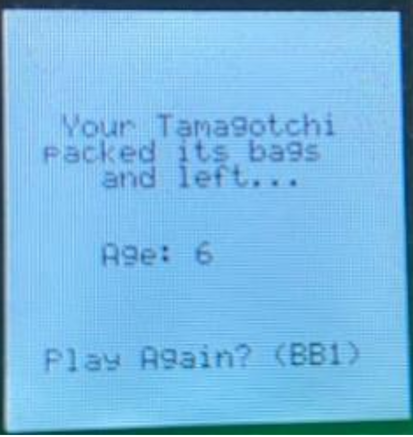

# Low-Power Tamagotchi
A low-power, interrupt-driven rendition of the classic Tamagotchi virtual pet game designed for the MSP432 microcontroller. In this project, players take care of a virtual pet by feeding it and playing with it using a joystick and buttons, all while the system conserves power by operating mostly in low-power mode.

## Overview

The game begins with the Title Screen that displays the project name and my name ("Antonio Dominguez") for 3 seconds before automatically transitioning to an Instructions Screen. The instructions explain the objectives and controls. Once the player presses BB1, the game starts:

- Game Screen:
    
    The game displays the Tamagotchi (starting as a child) with initial stats—Age (0), Energy (5), and Happiness (3).
    
    - Feeding: Pressing BB1 increases energy (up to a maximum of 5).
    - Playing: Tapping the joystick left or right moves the Tamagotchi in its playpen. Each two movements reduce energy by one, but playing increases happiness (up to a maximum of 5).
    - Aging: Every 3 seconds, the Tamagotchi ages, which decreases energy and happiness by one each.

 - Growth Stages:

    The pet transitions from a child (small, green) to a teen (medium, blue) and finally to an adult (large, red) if certain criteria are met:
    - To become a teen: Age ≥ 3, Energy ≥ 3, Happiness ≥ 4.
    - To become an adult: Age ≥ 7, Energy ≥ 2, Happiness ≥ 2.
    A safeguard ensures that the pet remains in the teen stage for at least one definitive age, even if criteria are instantly met.

 - Game Over:

    If both energy and happiness drop to 0, the pet "leaves," and the game transitions to a Game Over screen that displays the final age. Pressing BB1 restarts the game.

## Screenshots

1. Instruction Screen

    

Image 1.1 - The instruction screen displays the message about the game’s objective and controls

2. Starting Stat Values
    
    

Image 1.2: The game screen when it first starts shows the initial age, energy, and happiness values.

3. 2 Seconds and Moving Twice

    
Image 1.3: After 2 seconds and two joystick movements, energy decreases while happiness increases.

4. Grown Up to Teen
    
    

Image 1.4: The Tamagotchi grows into its teen form when the age and stat criteria are met.

5. Grown Up to Adult
    
    

Image 1.5: The pet advances to the adult stage as its age increases further and stat conditions are satisfied.

6. Game Over Screen
    
    

Image 1.6: When energy and happiness drop to 0, the game over screen displays the final age and a prompt to play again.

## Key Features

- Interrupt-Driven Architecture:

The game uses the MSP432’s interrupt system (via NVIC and low-power mode using PCM_gotoLPM0()) to minimize power usage by waking the processor only when needed.

- Non-Blocking Functions:

Designed with non-blocking functions, the joystick button that lights a green LED and a “sleeping check” using the Launchpad’s green LED to indicate low processor usage.

- Additional Button Functionality:

When LB1, LB2, or BB2 is pressed, a blue LED lights up. This meets the requirement to handle all buttons via interrupt.

## Architecture

The project architecture is divided into two main levels:

Board-Level:

- Connections: Buttons, LEDs, joystick (x-axis, y-axis, select button), and LCD display.
- Timers: Used for screen transitions and gameplay mechanics (e.g., energy/happiness decrease and aging).

Chip-Level (MSP432):

- Peripheral Connections: Detailed view of the connections on the MSP432 including timer setups, NVIC configuration, and pin multiplexing.
- The design uses a combination of the BoosterPack and Launchpad to interface with the necessary hardware.

    

Image 1.6: When energy and happiness drop to 0, the game over screen displays the final age and a prompt to play again.

## Requirements

- Hardware:
    - MSP432 Launchpad with BoosterPack
    - LCD display (Crystalfontz128x128)
    - Joystick and multiple buttons
- Software:
    - TI DriverLib for MSP432
    - TI Graphics Library

## How to Run

1. Setup the Hardware:
Connect the MSP432 Launchpad with the BoosterPack, ensuring all buttons, joystick, LEDs, and LCD are correctly wired.

2. Compile the Code:
Use Code Composer Studio or your preferred IDE configured for the MSP432. Make sure all HAL and driver library paths are properly set.

3. Flash the Device:
Upload the compiled binary to the MSP432.

4. Gameplay:
    - The game will automatically start on the Title Screen.
    - Follow the on-screen instructions and press BB1 to begin playing.
    - Use the joystick and other buttons as indicated to keep your Tamagotchi happy and energized.

## Important Notes

- Low-Power Implementation:

The use of PCM_gotoLPM0() in the main loop ensures that the microcontroller enters a low-power state, only waking for interrupts—this is central to the project's low-power design.

- Interrupt-Based Inputs:

All button presses and joystick movements are handled via interrupts to ensure minimal CPU load and power consumption.

- Debugging LEDs:

Additional LED indications are implemented to help verify proper button and joystick functioning.